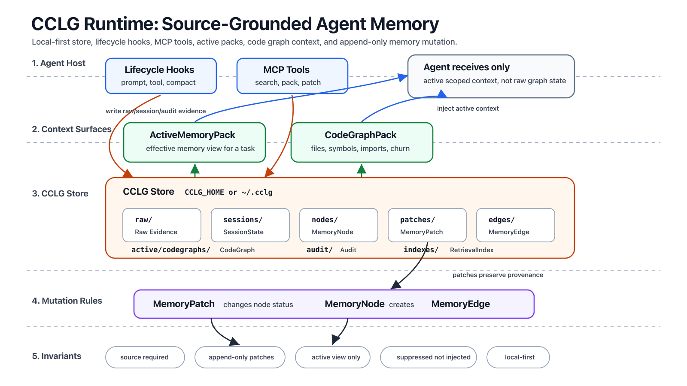

# CCLG

Local-first memory, hook, MCP, and code graph runtime for coding agents.



This map shows the core CCLG runtime: agent hosts call lifecycle hooks and MCP
tools, CCLG stores source evidence plus graph records, and only active packs
return to the agent as context.

CCLG keeps coding-agent memory on your machine. It turns agent history into a
Canonical Chat Ledger Graph:

- raw transcript and tool output stay as source evidence;
- long-term memory is stored as source-grounded JSON nodes;
- corrections are applied through explicit patches;
- agents consume only the active effective view;
- the whole ledger travels as one portable `.cclg` container file;
- hooks inject ActiveMemoryPack and CodeGraphPack context;
- MCP exposes memory, patch, code-search, and bench tools.

The broader product name from the original design discussion was ACMC,
Agentic Context Memory Compiler. This repository implements the local CCLG
runtime first. Hosted API is intentionally out of scope for this phase.

## Install CCLG

One command installs the local CLI, hook adapter, MCP server, Codex skills, and
safe config examples:

```bash
curl -fsSL https://raw.githubusercontent.com/schift-io/cclg/main/scripts/install.sh | bash
```

Prerequisites:

- Python 3.11 or newer;
- Git;
- a POSIX shell;
- Codex or Claude only if you want to wire the optional host integrations.

If `cclg` is not on your shell path after install:

```bash
export PATH="$HOME/.local/bin:$PATH"
```

Installed commands:

```text
~/.local/bin/cclg
~/.local/bin/acmc
~/.local/bin/cclg-hook
~/.local/bin/cclg-mcp
```

Default memory store:

```text
~/.cclg
```

The installer also copies example host config files:

```text
~/.codex/hooks.cclg-example.json
~/.codex/mcp.cclg-example.json
~/.claude/settings.cclg-example.json
```

These examples are intentionally not merged into your live config. Review and
merge them only after checking your existing hooks and MCP entries.

## Install From Checkout

```bash
git clone https://github.com/schift-io/cclg.git
cd cclg
./scripts/install.sh --from-checkout
```

For local development from the checkout:

```bash
./scripts/install.sh --from-checkout --editable
```

## Optional Dense Retrieval

Dense retrieval is off by default. The local MVP works with exact grep, BM25,
graph, temporal indexes, and source-grounded packs without embeddings.

Enable dense retrieval during install only when you want it:

```bash
CCLG_DENSE_PROVIDER=local ./scripts/install.sh --from-checkout
```

Supported provider values:

```text
auto local ollama openai schift google cloudflare
```

Hosted providers need their normal environment keys. Local dense mode installs
`cclg[dense]` into the CCLG virtual environment and uses a local embedding model.

Check the current dense setting:

```bash
cclg dense status
```

## Verify

After install, run:

```bash
cclg status
cclg doctor --json
cclg bench run --suite all --repo-root "$PWD"
```

`doctor` checks store invariants. `bench` exercises mutation, detection,
retrieval, pack, hook, MCP, and code graph surfaces.

## Quick Start

Add and retrieve a source-grounded memory:

```bash
cclg add \
  --type project_decision \
  --content "CCLG is local-first by default." \
  --source "manual:quickstart"
cclg grep "local-first"
cclg search "local-first"
cclg pack --query "what memory should this agent use?" --format toml
```

Code graph context:

```bash
cclg code-index "$PWD"
cclg code-search "MemoryPatch compile_pack" --repo "$PWD"
```

Hook smoke:

```bash
printf '%s' '{"prompt":"CCLG hook smoke","session_id":"demo"}' \
  | cclg-hook user-prompt --include-codegraph --code-root "$PWD"
```

MCP smoke:

```bash
printf '%s\n' \
  '{"jsonrpc":"2.0","id":1,"method":"initialize","params":{}}' \
  '{"jsonrpc":"2.0","id":2,"method":"tools/list","params":{}}' \
  | cclg-mcp --line-delimited
```

## Codex And Claude Setup

The installer writes Codex skills automatically:

```text
~/.codex/skills/cclg-memory
~/.codex/skills/cclg-codegraph
~/.codex/skills/cclg-hooks
~/.codex/skills/cclg-bench
```

If you need to regenerate only the Codex skills:

```bash
cclg apply-codex --write-skill
```

Hook and MCP examples are copied to `~/.codex` and `~/.claude` as example files.
They are not live until you merge them into your host settings.

## Use CCLG From Your Stack

One format, three consumption modes — the same `.cclg` ledger travels between
all of them:

```text
                       .cclg  (one portable memory format)
                          |
        +-----------------+----------------------+
        |                 |                      |
        v                 v                      v
+------------------+  +--------------------+  +----------------------+
| coding agents    |  | agent runtimes     |  | hosted memory        |
|                  |  | (APM agent packs)  |  |                      |
| Claude Code      |  |                    |  | example:             |
| Codex            |  | example:           |  |  Schift AI Memory    |
| Hermes           |  |  Schift runtime    |  |                      |
|                  |  |                    |  |                      |
| hooks + MCP      |  | store-less library |  | lossless container   |
| ~/.cclg store    |  | over tenant memory |  | load + effective-    |
| ActiveMemoryPack |  | + .cclg export     |  | view projection      |
+------------------+  +--------------------+  +----------------------+
```

### With coding agents (Claude Code / Codex / Hermes)

The installer wires lifecycle hooks and the MCP server into the host. Every
session accumulates source-grounded nodes in `~/.cclg`; corrections become
patches; the hook injects only the active effective view as an
ActiveMemoryPack. Hermes and other agent-workbench hosts integrate the same
way: hook on user prompt, MCP tools for explicit memory/patch/search calls.

### With an APM agent runtime (example: Schift)

Runtimes that execute APM (Microsoft's agent package standard) packages can
bind CCLG as their memory layer. Schift's runtime does exactly this — it
consumes CCLG as a store-less library over its own tenant-scoped memory store,
no second store, no sync:

```text
tenant memory store (single source of truth)
        | memories
        v
CCLG effective view   -> corrected/forgotten facts never reach sub-agents
CCLG patch detection  -> user corrections become supersession patches
ActiveMemoryPack      -> session context, order-stable + token-budgeted
.cclg export          -> any session leaves as one portable container file
```

The pack is what the agent actually reads: stable ordering keeps provider
prompt caches warm, and the budget keeps token spend bounded. The export means
an agent's memory is never locked in — it is a file.

### With hosted memory (example: Schift AI Memory)

The hosted wrapper loads `.cclg` containers losslessly: the container bytes are
preserved verbatim (patches and edges stay first-class records), and the
searchable flat view is derived as a projection of the on-load effective view —
never a second source of truth.

### Bring your own runtime

The core stays host-agnostic. Runtime-specific install paths and host adapters
(a new agent host's hook config, an APM pack-runtime binding) land as pull
requests: adapters live under `adapters/<host>/`, integration docs under
`docs/`. If your runtime can read JSON and verify a sha256, it can speak
`.cclg`.

## CCLG As The Schift AI Memory Format

Yes: the target architecture is that Schift AI Memory uses CCLG as its memory
format/runtime. They should not be treated as two permanent memory formats.
The current split exists only because the kernel and the product wrapper are
being hardened at different layers.

```text
Schift memory strategy
        |
        +-- CCLG
        |     canonical memory format / local runtime / kernel
        |     proves: ledger, provenance, patches, active packs, code graph
        |     ships: cclg, cclg-hook, cclg-mcp, ~/.cclg
        |
        +-- Schift AI Memory
              Schift product wrapper / auth / hosted routing
              proves: OAuth, API key, Schift bucket, work-log upload, MCP fetch
              ships: npx installer, Schift auth, plugin/host config
```

The intended dependency direction:

```text
Schift AI Memory
        |
        | uses CCLG records and packs
        v
      CCLG

NOT:

CCLG
        |
        | depends on Schift auth/buckets
        v
Schift AI Memory
```

That means Schift AI Memory should add a Schift envelope around CCLG data, not
replace the CCLG memory model:

```text
CCLG node / session / pack
        |
        v
+--------------------------------------+
| Schift AI Memory transport envelope  |
| org_id / user_id / bucket / policy   |
| upload status / queue metadata       |
+--------------------------------------+
        |
        v
Schift bucket / company memory surface
```

The practical reason to keep both repositories during this phase:

```text
CCLG answers:             "What is the memory model?"
Schift AI Memory answers: "How does a Schift user install, auth, sync, and query it?"
```

Maintenance rule:

```text
Keep CCLG separate while the format/runtime is still being hardened.
Do not duplicate CCLG node/patch/pack semantics in Schift AI Memory.
Make Schift AI Memory consume CCLG as the canonical format.
```

Concrete adapter plan: [docs/SCHIFT_AI_MEMORY_FORMAT.md](docs/SCHIFT_AI_MEMORY_FORMAT.md).

## Current Runtime Compatibility

The loader half of that adapter has landed: Schift AI Memory reads `.cclg`
containers losslessly and carries CCLG-shaped records instead of a competing
format. Operationally the two packages still run as side-by-side host
integrations with separate stores.

```text
                 same Codex / Claude host
                    hooks / MCP config
                            |
          +-----------------+-----------------+
          |                                   |
          v                                   v
+--------------------------+      +--------------------------+
| CCLG                     |      | Schift AI Memory         |
| local working memory     |      | company work log         |
| store: ~/.cclg           |      | config: ~/.schift/...    |
| raw / nodes / patches    |      | store: Schift bucket     |
| ActiveMemoryPack         |      | summaries / metadata     |
| CodeGraphPack            |      | search / fetch           |
+------------+-------------+      +------------+-------------+
             |                                 |
             v                                 v
   current task context             company memory surface
```

What works today (verified end-to-end against real producer bytes):

```text
runtime session export  --->  .cclg  (corrections preserved as patches)
.cclg container         --->  Schift AI Memory envelope
                              (verbatim container payload, zero record loss;
                               patches/edges stay first-class records)
on-load effective view  --->  searchable flat projection
                              (superseded/forgotten facts excluded)
```

Still pending on the hosted side:

```text
live upload/search smoke against a real Schift bucket
Schift search result    -X->  CCLG raw evidence import
Schift bucket policy    -X->  CCLG local ledger state
```

Use CCLG for local task context and Schift AI Memory for Schift-owned work-log
upload/retrieval. When both are installed today, merge hook and MCP config
explicitly instead of overwriting either tool's generated examples.

## Update Or Uninstall

Update from the public repository by rerunning the installer:

```bash
curl -fsSL https://raw.githubusercontent.com/schift-io/cclg/main/scripts/install.sh | bash
```

From a checkout:

```bash
git pull --ff-only
./scripts/install.sh --from-checkout
```

Uninstall commands and installed app files while keeping local memory:

```bash
~/.local/share/cclg/repo/scripts/uninstall.sh
```

Delete local memory too:

```bash
~/.local/share/cclg/repo/scripts/uninstall.sh --purge-store
```

From a checkout, the same commands can be run as `./scripts/uninstall.sh`.

The PRD used `acmc` as the product command name. This repo keeps `cclg` as the
primary binary and installs `acmc` as the same local CLI alias.

## Format

Visual explainer:

```text
docs/explainer/index.html
docs/explainer/cclg-runtime-map.png
format/cclg.format.v0.1.toml
docs/DATA_MODEL.md
docs/explainer/demo-store/
```

CCLG records are versioned by `format/cclg.format.v0.1.toml`.

### MemoryNode

```json
{
  "schema_version": "cclg.memory_node.v0.1",
  "id": "mem_...",
  "type": "project_decision",
  "scope": {
    "user": "user_local",
    "org": null,
    "workspace": "local",
    "project": "CCLG",
    "agent": "global",
    "session": null
  },
  "key": "project.cclg.local_first",
  "content": "CCLG is local-first by default.",
  "status": "active",
  "confidence": 1.0,
  "priority": "high",
  "source": {
    "label": "manual:quickstart",
    "session_ids": [],
    "turn_ids": [],
    "raw_spans": [],
    "tool_result_ids": [],
    "artifact_ids": []
  },
  "relations": {
    "supersedes": [],
    "superseded_by": [],
    "refines": [],
    "expands": [],
    "narrows": [],
    "contradicts": [],
    "depends_on": [],
    "derived_from": []
  },
  "retrieval": {
    "sparse_keys": ["cclg", "local-first"],
    "dense_text": "CCLG is local-first by default.",
    "entity_keys": [],
    "temporal_keys": []
  }
}
```

Statuses:

```text
active            can be injected
active_session    can be injected only for that session id
superseded        replaced by newer memory
deprecated        discouraged old memory
expired           no longer valid
forgotten         intentionally removed from active memory
discarded         rollback/session discard output
```

### MemoryPatch

```json
{
  "schema_version": "cclg.memory_patch.v0.1",
  "id": "patch_...",
  "operation": "refine",
  "target_ids": ["mem_old"],
  "new_node_ids": ["mem_new"],
  "reason": "User clarified adapter scope.",
  "new_content": "CCLG must support Claude Code, Codex, Hermes, and hosted ReACT agents.",
  "source": {
    "label": "manual",
    "session_ids": [],
    "turn_ids": [],
    "raw_spans": [],
    "tool_result_ids": [],
    "artifact_ids": []
  },
  "resolution_policy": {
    "rule": "manual",
    "auto_applied": true,
    "requires_review": false
  }
}
```

Patch operations:

```text
create update supersede refine expand narrow merge split expire deprecate
forget resolve_conflict rollback
```

### MemoryEdge

```json
{
  "schema_version": "cclg.edge.v0.1",
  "id": "edge_...",
  "from": "mem_new",
  "to": "mem_old",
  "type": "refines",
  "source_patch_id": "patch_..."
}
```

### ActiveMemoryPack

Task-scoped prompt context. It includes active memory and labels suppressed
memory so agents do not inject it as current truth.

```bash
cclg pack --query "current task" --format markdown
```

### CodeGraphPack

Task-scoped code context. It ranks files and symbols using git files,
definitions, imports, edges, and churn. It is context ordering, not source proof.

```bash
cclg code-search "symbol or task" --repo "$PWD"
```

## Hooks and Tools

Hook adapter:

```bash
cclg-hook user-prompt --include-codegraph --code-root "$PWD"
```

MCP server:

```bash
cclg-mcp
```

MCP tools:

```text
cclg.search
cclg.grep
cclg.bm25
cclg.pack
cclg.add
cclg.patch
cclg.raw
cclg.code_index
cclg.code_search
cclg.audit
cclg.bench
memory.search
memory.grep
memory.bm25
memory.pack
memory.patch
memory.audit
```

Safe config examples are installed to:

```text
~/.codex/hooks.cclg-example.json
~/.codex/mcp.cclg-example.json
~/.claude/settings.cclg-example.json
```

The installer does not overwrite existing Codex or Claude config.

## Bench Scorecard

Local deterministic suites:

```text
mutation   stale memory suppression
retrieval  sparse active memory retrieval
pack       ActiveMemoryPack excludes suppressed nodes
hook       additionalContext injection
mcp        initialize, tools/list, tools/call
codegraph  files, symbols, edges, search
```

Run:

```bash
cclg bench run --suite all --repo-root "$PWD"
```

External benchmark tracks to add next:

- LoCoMo / LongMemEval / LongMemEval-V2 / FAMA for memory quality.
- MCP-Bench / MCPBench / LiveMCPBench / MCP-Universe style tasks for tool use.
- Aider repo-map and Tree-sitter code-graph tasks for code graph quality.

See [docs/BENCH_SCORECARD.md](docs/BENCH_SCORECARD.md).

## Storage

```text
~/.cclg/
  raw/                 source evidence
  nodes/               MemoryNode JSON
  patches/             MemoryPatch JSON
  edges/               MemoryEdge JSON
  sessions/            hook/session event state
  active/codegraphs/   generated CodeGraph artifacts
  audit/               JSONL audit log
```

Raw sources are the source of truth. Summaries are routing aids, not authority.

## Portable `.cclg` Container

The whole ledger can travel as one file. `cclg pack-file` packs the raw ledger
records (nodes, patches, edges, sessions) into a single portable `.cclg`
container; `cclg open` validates and inspects one without loading it into a
store.

```bash
cclg pack-file backup.cclg
cclg open backup.cclg
```

`cclg pull` imports a tenant's CORE/AGENT memory scope from a Schift
agent-hub `.cclg` export (`GET /v1/memory/export.cclg`) into the local store —
same-id/same-content is skipped, a same-id content conflict marks the local
node `conflict_pending` and links the remote version via
`relations.contradicts` instead of overwriting. The auth secret is read from
`CCLG_PULL_SECRET` (env-only, never a flag):

```bash
CCLG_PULL_SECRET=... cclg pull --remote https://agent-hub.internal --tenant acme --scope core
```

Container invariants:

```text
ledger-only     the effective view is never stored; it is recomputed on load
auth-free       no tokens, credentials, or host paths inside the container
layout-free     self-contained; does not depend on ~/.cclg internals
checksummed     sha256 over the record payload; tampering fails open
```

Think `.gguf` for agent memory: the container is the interchange boundary.
Any runtime that speaks `cclg.container.v0.1` — the local CLI, a hosted
loader, another agent host — can load the same memory losslessly, patches and
provenance included.

Spec: [docs/CCLG_CONTAINER.md](docs/CCLG_CONTAINER.md).

## Public Release

Target:

```text
https://github.com/schift-io/cclg
```

Dry run:

```bash
scripts/publish-github.sh
```

Create/push:

```bash
scripts/publish-github.sh --execute
```

## Docs

- [The `.cclg` standard (spec + conformance + MCP binding + implementations)](docs/STANDARD.md)
- [Format](docs/FORMAT.md)
- [Container format `.cclg`](docs/CCLG_CONTAINER.md)
- [Canonical format TOML](format/cclg.format.v0.1.toml)
- [Data model and hook flow](docs/DATA_MODEL.md)
- [Architecture](docs/ARCHITECTURE.md)
- [Patch semantics](docs/PATCH_SEMANTICS.md)
- [Tools and hooks](docs/TOOLS_AND_HOOKS.md)
- [Code graph](docs/CODE_GRAPH.md)
- [Bench scorecard](docs/BENCH_SCORECARD.md)
- [Publishing](docs/PUBLISHING.md)
- [Research notes](docs/RESEARCH_NOTES.md)
